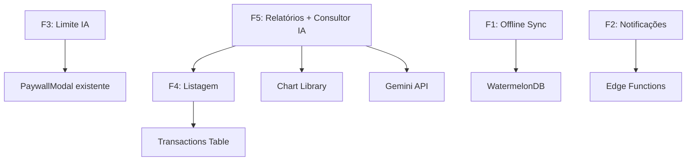

# 🚀 Roadmap de Features Futuras - FinAInteli

> Planejamento para implementar: sincronização offline, notificações de orçamento, limite de IA para free tier, tela de listagem de transações, e relatórios avançados Pro.

## 📋 Visão Geral das Features

| #   | Feature                         | Prioridade | Complexidade | Dependência Premium |
| --- | ------------------------------- | ---------- | ------------ | ------------------- |
| F1  | Sincronização Offline           | 🔴 Alta    | Alta         | Não                 |
| F2  | Notificações de Orçamento       | 🟡 Média   | Média        | Não                 |
| F3  | Limite de 3 dicas IA/dia (Free) | 🔴 Alta    | Baixa        | Sim (Core)          |
| F4  | Tela de Listagem de Transações  | 🔴 Alta    | Média        | Não                 |
| F5  | Relatórios e Gráficos Avançados | 🟡 Média   | Alta         | Sim (Pro Only)      |

---

## Feature F1: Sincronização Offline

### 📖 Descrição

Permitir que usuários criem, editem e visualizem transações mesmo sem conexão à internet. As alterações serão sincronizadas automaticamente quando a conexão for restabelecida.

### 🎯 Objetivos

- [x] Armazenamento local de dados com SQLite/WatermelonDB
- [ ] Queue de operações pendentes
- [ ] Sincronização automática ao reconectar
- [ ] Indicador visual de status de conexão
- [ ] Resolução de conflitos (last-write-wins)

### 📦 Entregáveis

#### F1.1 - Configuração de Banco Local

```
Arquivos:
├── src/database/
│   ├── schema.ts           # Schema WatermelonDB
│   ├── models/
│   │   ├── Transaction.ts  # Model local
│   │   ├── Account.ts
│   │   └── Card.ts
│   └── sync/
│       ├── syncManager.ts  # Gerenciador de sync
│       └── conflictResolver.ts
```

**Stack Recomendada:**

- **WatermelonDB** - ORM reativo para React Native com sync
- **NetInfo** - Detecção de conectividade
- **Zustand** - Estado de sync (já usado no projeto)

#### F1.2 - Queue de Operações

```typescript
// src/store/syncQueueStore.ts
interface SyncOperation {
  id: string;
  type: "create" | "update" | "delete";
  table: "transactions" | "accounts" | "cards";
  data: Record<string, any>;
  createdAt: Date;
  retries: number;
  status: "pending" | "syncing" | "failed";
}
```

#### F1.3 - UI de Status

```
Componentes:
├── src/components/ui/
│   ├── SyncIndicator.tsx      # Ícone no header
│   ├── OfflineBanner.tsx      # Banner "Modo Offline"
│   └── PendingSyncBadge.tsx   # Badge em transações pendentes
```

### 📊 Estimativa

| Item               | Tempo    |
| ------------------ | -------- |
| Setup WatermelonDB | 2h       |
| Sync Manager       | 4h       |
| Queue de Operações | 2h       |
| UI Components      | 2h       |
| Testes             | 2h       |
| **Total**          | **~12h** |

---

## Feature F2: Notificações de Orçamento

### 📖 Descrição

Notificar usuários quando estiverem próximos de atingir ou ultrapassarem seus limites de orçamento por categoria.

### 🎯 Objetivos

- [x] Notificação push quando atingir 80% do orçamento
- [x] Notificação push quando exceder 100% do orçamento
- [x] Configuração de alertas personalizados (50, 80, 100%)
- [ ] Resumo semanal de gastos (opcional)

> **Nota de Implementação:** Optou-se por verificação local (`useBudgetMonitor`) integrada ao Dashboard e à criação de transações, utilizando `expo-notifications` para agendamento local, evitando custos e complexidade de Edge Functions neste momento.

### 📦 Entregáveis

#### F2.1 - Service de Alertas

```typescript
// src/services/budgetAlerts.ts
export interface BudgetAlert {
  budgetId: string;
  userId: string;
  threshold: 0.8 | 1.0; // 80% ou 100%
  currentSpent: number;
  limit: number;
  categoryName: string;
}

export const checkBudgetThresholds = async (userId: string): Promise<BudgetAlert[]>;
export const scheduleBudgetNotification = async (alert: BudgetAlert): Promise<void>;
```

#### F2.2 - Edge Function Supabase (Cron)

```typescript
// supabase/functions/check-budgets/index.ts
// Executar diariamente às 20:00
Deno.serve(async () => {
  // 1. Buscar todos os budgets ativos
  // 2. Calcular gastos do período atual
  // 3. Disparar push para quem atingiu thresholds
});
```

#### F2.3 - Configurações do Usuário

```sql
-- Migration: add_notification_preferences
ALTER TABLE public.user_profiles ADD COLUMN IF NOT EXISTS
  notification_preferences JSONB DEFAULT '{
    "budget_80_alert": true,
    "budget_100_alert": true,
    "weekly_summary": false,
    "push_enabled": true
  }';
```

#### F2.4 - UI de Configuração

```
Telas:
├── app/(app)/settings/notifications.tsx  # Já existe, expandir
│   ├── Toggle: Alertas de 80%
│   ├── Toggle: Alertas de 100%
│   └── Toggle: Resumo Semanal
```

### 📊 Estimativa

| Item                    | Tempo   |
| ----------------------- | ------- |
| Budget Alerts Service   | 2h      |
| Edge Function (Cron)    | 2h      |
| Migration + Preferences | 1h      |
| UI de Configuração      | 1h      |
| Testes                  | 1h      |
| **Total**               | **~7h** |

---

## Feature F3: Limite de 3 Dicas IA/Dia (Free Tier)

### 📖 Descrição

Implementar limite de 3 consultas à IA (SmartTipCard/Advisor) por dia para usuários do plano gratuito. Usuários Premium têm acesso ilimitado.

### 🎯 Objetivos

- [x] Contador de uso diário de IA
- [x] Persistência do contador (Supabase)
- [x] Reset automático à meia-noite (UTC-3)
- [x] UI indicando uso restante
- [x] Prompt de upgrade quando limite atingido

### 📦 Entregáveis

#### F3.1 - Tabela de Uso de IA

```sql
-- Migration: create_ai_usage_table
CREATE TABLE public.ai_usage (
  id UUID PRIMARY KEY DEFAULT gen_random_uuid(),
  user_id UUID NOT NULL REFERENCES auth.users(id) ON DELETE CASCADE,
  usage_date DATE NOT NULL DEFAULT CURRENT_DATE,
  tip_count INTEGER DEFAULT 0,
  advisor_count INTEGER DEFAULT 0,
  created_at TIMESTAMPTZ DEFAULT now(),
  updated_at TIMESTAMPTZ DEFAULT now(),
  UNIQUE(user_id, usage_date)
);

-- RLS
ALTER TABLE public.ai_usage ENABLE ROW LEVEL SECURITY;
CREATE POLICY "Users can manage own AI usage" ON public.ai_usage
  FOR ALL USING (auth.uid() = user_id);
```

#### F3.2 - Hook de Limite de IA

```typescript
// src/hooks/useAILimit.ts
export interface AILimitState {
  tipCount: number;
  advisorCount: number;
  dailyLimit: number; // 3 para free, Infinity para pro
  canUseTip: boolean;
  canUseAdvisor: boolean;
  remainingTips: number;
  resetTime: Date; // Próxima meia-noite
}

export const useAILimit = (): AILimitState & {
  incrementTipUsage: () => Promise<boolean>;
  incrementAdvisorUsage: () => Promise<boolean>;
};
```

#### F3.3 - Integração nos Componentes

```typescript
// Modificar: src/components/dashboard/SmartTipCard.tsx
const SmartTipCard = () => {
  const { canUseTip, remainingTips, incrementTipUsage } = useAILimit();
  const { isPremium } = usePremium();

  const handleGetTip = async () => {
    if (!canUseTip) {
      // Mostrar PaywallModal
      return;
    }
    await incrementTipUsage();
    // ... lógica existente
  };

  return (
    <Card>
      {/* ... conteúdo existente */}
      {!isPremium && (
        <Text style={styles.usageCounter}>
          {remainingTips}/3 dicas restantes hoje
        </Text>
      )}
    </Card>
  );
};
```

#### F3.4 - UI de Limite Atingido

```
Componentes:
├── src/components/ui/AILimitReached.tsx
│   └── Modal com:
│       ├── Ícone de limite
│       ├── "Você atingiu o limite de 3 dicas hoje"
│       ├── "Volte amanhã ou assine o Pro"
│       └── [Conhecer o Pro] [Fechar]
```

### 📊 Estimativa

| Item                    | Tempo   |
| ----------------------- | ------- |
| Migration + RLS         | 30min   |
| useAILimit Hook         | 1h      |
| Integração SmartTipCard | 1h      |
| Integração Advisor      | 1h      |
| UI de Limite            | 30min   |
| Testes                  | 1h      |
| **Total**               | **~5h** |

---

## Feature F4: Tela de Listagem de Transações

### 📖 Descrição

Criar tela dedicada para visualizar, filtrar e gerenciar todas as transações do usuário.

### 🎯 Objetivos

- [x] Lista paginada de transações (FlatList)
- [x] Filtros: tipo (receita/despesa)
- [x] Busca por descrição
- [x] Agrupamento por data
- [x] Ações: editar, excluir
- [ ] Export CSV (Pro) - futuro

### 📦 Entregáveis

#### F4.1 - Tela Principal

```
Arquivos:
├── app/(app)/transactions/
│   ├── index.tsx           # Lista de transações
│   ├── [id].tsx            # Detalhes/Edição
│   ├── new.tsx             # ✅ Já existe
│   └── _components/
│       ├── TransactionItem.tsx
│       ├── TransactionFilters.tsx
│       ├── TransactionSearch.tsx
│       └── DateGroupHeader.tsx
```

#### F4.2 - Layout da Lista

```
┌─────────────────────────────────────────────────┐
│  ← Transações                    [🔍] [⚙️]     │
├─────────────────────────────────────────────────┤
│  [Período ▼]  [Categoria ▼]  [Tipo ▼]  [Conta]  │
├─────────────────────────────────────────────────┤
│                                                 │
│  ╭── Hoje, 21 Jan ──────────────────────────╮   │
│  │                                           │   │
│  │  🍔 Alimentação          - R$ 45,00      │   │
│  │     iFood · Nubank                        │   │
│  │                                           │   │
│  │  💼 Salário              + R$ 5.500,00   │   │
│  │     Empresa XYZ · Itaú                    │   │
│  │                                           │   │
│  ╰───────────────────────────────────────────╯   │
│                                                 │
│  ╭── Ontem, 20 Jan ─────────────────────────╮   │
│  │                                           │   │
│  │  🚗 Transporte           - R$ 120,00     │   │
│  │     Uber · Nubank                         │   │
│  │                                           │   │
│  ╰───────────────────────────────────────────╯   │
│                                                 │
│        [Carregar mais transações...]            │
│                                                 │
└─────────────────────────────────────────────────┘
```

#### F4.3 - Filtros e Busca

```typescript
// src/hooks/useTransactionFilters.ts
interface TransactionFilters {
  startDate?: Date;
  endDate?: Date;
  categoryIds?: string[];
  type?: "income" | "expense" | "all";
  accountId?: string;
  cardId?: string;
  searchQuery?: string;
}

export const useTransactionFilters = () => {
  const [filters, setFilters] = useState<TransactionFilters>({});
  const { transactions, fetchMore, hasNextPage, isLoading } = useInfiniteTransactions(filters);
  // ...
};
```

#### F4.4 - Navegação

- Adicionar na Tab Bar ou Drawer como "Transações"
- Link do Dashboard "Ver todas" → Lista de Transações

### 📊 Estimativa

| Item                      | Tempo     |
| ------------------------- | --------- |
| TransactionItem Component | 1h        |
| Lista com Infinite Scroll | 2h        |
| Filtros UI                | 2h        |
| Busca                     | 1h        |
| Edição/Exclusão           | 2h        |
| Navegação                 | 30min     |
| Testes                    | 1h        |
| **Total**                 | **~9.5h** |

---

## Feature F5: Relatórios e Gráficos Avançados + Consultor IA (Pro)

### 📖 Descrição

Criar tela de relatórios com visualizações avançadas: gráficos de evolução, comparativos mensais, análise por categoria, e export de dados. **Inclui Consultor Financeiro com IA** que analisa dados de ano, mês e semana para fornecer insights personalizados como um consultor financeiro pessoal. **Exclusivo para usuários Premium.**

### 🎯 Objetivos

#### Relatórios Visuais

- [ ] Gráfico de evolução patrimonial (linha)
- [ ] Gráfico de gastos por categoria (pizza/donut)
- [ ] Comparativo mês a mês (barras)
- [ ] Resumo de receitas vs despesas
- [ ] Filtro por período customizado

#### Consultor Financeiro IA 🤖

- [ ] Análise de gastos por período (semana, mês, ano)
- [ ] Identificação de gastos desnecessários ou excesivos
- [ ] Comparativo de gastos entre meses ("Você gastou 30% a mais em delivery este mês")
- [ ] Sugestões de onde pode ter mais liberdade para gastar
- [ ] Alertas sobre padrões preocupantes
- [ ] Elogios quando o usuário está indo bem ("Parabéns! Seu gasto com lazer foi 20% menor")
- [ ] Dicas personalizadas baseadas no perfil de gastos
- [ ] Previsões de gastos futuros baseado em histórico

#### Exportação

- [ ] Export PDF dos dados e insights
- [ ] Export CSV dos dados brutos
- [ ] Paywall para usuários Free

### 📦 Entregáveis

#### F5.1 - Tela de Relatórios

```
Arquivos:
├── app/(app)/(tabs)/reports.tsx    # Nova tab
├── app/(app)/reports/
│   ├── _layout.tsx
│   ├── overview.tsx                # Visão geral
│   ├── categories.tsx              # Por categoria
│   ├── evolution.tsx               # Evolução temporal
│   └── export.tsx                  # Exportar dados
```

#### F5.2 - Componentes de Gráfico

```typescript
// Stack: react-native-chart-kit ou victory-native

// src/components/reports/
├── EvolutionChart.tsx      // Gráfico de linha (saldo ao longo do tempo)
├── CategoryPieChart.tsx    // Gráfico pizza de gastos por categoria
├── MonthlyBarChart.tsx     // Comparativo mensal
├── IncomeExpenseChart.tsx  // Receita vs Despesa
└── ReportCard.tsx          // Card wrapper com estilo
```

#### F5.3 - Layout da Tela

```
┌─────────────────────────────────────────────────┐
│  ← Relatórios                         [Export]  │
├─────────────────────────────────────────────────┤
│  [Jan 2026 ▼]   ──────────   [Fev 2026 ▼]      │
├─────────────────────────────────────────────────┤
│                                                 │
│  ╭── Evolução Patrimonial ──────────────────╮   │
│  │                                           │   │
│  │        ╱╲                                 │   │
│  │       ╱  ╲    ╱╲                          │   │
│  │  ────╱    ╲──╱  ╲────                     │   │
│  │                                           │   │
│  │  Jan   Fev   Mar   Abr   Mai              │   │
│  ╰───────────────────────────────────────────╯   │
│                                                 │
│  ╭── Gastos por Categoria ──────────────────╮   │
│  │                                           │   │
│  │       🍕 35%  🚗 25%  🏠 20%  📱 20%      │   │
│  │           [Gráfico de Pizza]              │   │
│  │                                           │   │
│  ╰───────────────────────────────────────────╯   │
│                                                 │
│  ╭── Receita vs Despesa ────────────────────╮   │
│  │  Receitas:  R$ 8.500,00    ████████████  │   │
│  │  Despesas:  R$ 4.200,00    ██████        │   │
│  │  Economia:  R$ 4.300,00 (+50%)           │   │
│  ╰───────────────────────────────────────────╯   │
│                                                 │
└─────────────────────────────────────────────────┘
```

#### F5.4 - Paywall Integration

```typescript
// app/(app)/(tabs)/reports.tsx
const ReportsScreen = () => {
  const { isPremium, showPaywall } = usePremium();

  if (!isPremium) {
    return (
      <ProFeatureGate
        feature="Relatórios Avançados"
        description="Visualize gráficos detalhados e exporte seus dados"
        onUnlock={() => showPaywall()}
      />
    );
  }

  return <ReportsContent />;
};
```

#### F5.5 - Export Service

```typescript
// src/services/reportExport.ts
export const exportTransactionsCSV = async (
  userId: string,
  startDate: Date,
  endDate: Date
): Promise<string>; // Returns file URI

export const generatePDFReport = async (
  userId: string,
  reportType: 'monthly' | 'yearly' | 'custom',
  options: ReportOptions
): Promise<string>; // Returns file URI
```

#### F5.6 - Consultor Financeiro IA 🤖

```
Arquivos:
├── src/services/aiAdvisor.ts           # Serviço de análise com Gemini
├── src/components/reports/
│   ├── AIInsightsCard.tsx              # Card com insights do consultor
│   ├── SpendingAlertCard.tsx           # Alertas de gastos
│   ├── PositiveFeedbackCard.tsx        # Elogios e conquistas
│   └── AIRecommendationsList.tsx       # Lista de recomendações
```

```typescript
// src/services/aiAdvisor.ts
interface FinancialAnalysis {
  period: 'week' | 'month' | 'year';
  startDate: Date;
  endDate: Date;
  totalIncome: number;
  totalExpenses: number;
  categoryBreakdown: CategoryExpense[];
  previousPeriodComparison?: PeriodComparison;
}

interface AIInsight {
  type: 'warning' | 'alert' | 'praise' | 'tip' | 'prediction';
  icon: string;
  title: string;
  message: string;
  category?: string;
  impact?: 'high' | 'medium' | 'low';
  actionable?: boolean;
  suggestedAction?: string;
}

export const AIAdvisorService = {
  /**
   * Analisa os dados financeiros e retorna insights personalizados
   * como um consultor financeiro pessoal faria.
   */
  async analyzeFinances(
    userId: string,
    period: 'week' | 'month' | 'year'
  ): Promise<AIInsight[]>;

  /**
   * Compara dois períodos e identifica diferenças significativas
   */
  async comparePeriods(
    userId: string,
    currentPeriod: FinancialAnalysis,
    previousPeriod: FinancialAnalysis
  ): Promise<AIInsight[]>;

  /**
   * Identifica gastos que podem ser desnecessários ou excessivos
   */
  async identifyUnnecessarySpending(
    transactions: Transaction[]
  ): Promise<AIInsight[]>;

  /**
   * Sugere onde o usuário pode ter mais liberdade para gastar
   */
  async suggestFlexibleSpending(
    analysis: FinancialAnalysis
  ): Promise<AIInsight[]>;
};
```

#### F5.7 - Layout da Tela de Insights IA

```
┌─────────────────────────────────────────────────┐
│  ← Consultor IA                      [Período ▼]│
├─────────────────────────────────────────────────┤
│                                                 │
│  ╭── 🎯 Resumo do Período ──────────────────╮   │
│  │  Janeiro 2026                             │   │
│  │  Receitas: R$ 8.500  │  Despesas: R$ 4.200│   │
│  │  Economia: R$ 4.300 (+50.5%)              │   │
│  ╰───────────────────────────────────────────╯   │
│                                                 │
│  ╭── ⚠️ Atenção ─────────────────────────────╮   │
│  │  🍕 Delivery +45% vs último mês           │   │
│  │  "Você gastou R$320 em delivery este mês, │   │
│  │   contra R$220 em dezembro. Considere     │   │
│  │   cozinhar mais em casa para economizar." │   │
│  ╰───────────────────────────────────────────╯   │
│                                                 │
│  ╭── 🎉 Parabéns! ───────────────────────────╮   │
│  │  🚗 Transporte -30% vs último mês         │   │
│  │  "Excelente! Você reduziu seus gastos com │   │
│  │   transporte significativamente. Continue │   │
│  │   assim!"                                 │   │
│  ╰───────────────────────────────────────────╯   │
│                                                 │
│  ╭── 💡 Dicas do Consultor ──────────────────╮   │
│  │  • Você pode gastar mais com lazer este   │   │
│  │    mês, sua economia está 20% acima da    │   │
│  │    meta.                                  │   │
│  │                                           │   │
│  │  • Atenção: mês que vem tem IPTU, reserve │   │
│  │    R$ 800 baseado no ano passado.         │   │
│  │                                           │   │
│  │  • Seus gastos com assinaturas (R$189/mês)│   │
│  │    representam 4.5% da renda. Avalie se   │   │
│  │    todos os serviços estão sendo usados.  │   │
│  ╰───────────────────────────────────────────╯   │
│                                                 │
│  ╭── 🔮 Previsão ────────────────────────────╮   │
│  │  Baseado no seu histórico:                │   │
│  │  • Fevereiro: ~R$ 4.800 em despesas       │   │
│  │  • Maior gasto previsto: Alimentação      │   │
│  ╰───────────────────────────────────────────╯   │
│                                                 │
└─────────────────────────────────────────────────┘
```

#### Prompt Base para o Consultor IA

```typescript
const ADVISOR_PROMPT = `
Você é um consultor financeiro pessoal amigável e experiente.
Analise os dados financeiros do usuário e forneça insights acionáveis.

Seu papel é:
1. Identificar gastos desnecessários ou excessivos
2. Comparar com períodos anteriores e destacar mudanças
3. Elogiar conquistas e progressos
4. Alertar sobre padrões preocupantes
5. Sugerir onde o usuário pode gastar mais livremente
6. Prever gastos futuros baseado no histórico

Tom: Profissional mas amigável, encorajador, sem julgamentos.
Formato: Insights curtos e diretos com emojis apropriados.
Idioma: ${language === "pt-BR" ? "Português do Brasil" : "English"}
`;
```

### 📊 Estimativa

| Item                        | Tempo    |
| --------------------------- | -------- |
| **Gráficos**                |          |
| Setup Chart Library         | 1h       |
| EvolutionChart              | 2h       |
| CategoryPieChart            | 2h       |
| MonthlyBarChart             | 2h       |
| IncomeExpenseChart          | 1h       |
| Reports Screen              | 2h       |
| **Consultor IA**            |          |
| AIAdvisorService            | 4h       |
| AIInsightsCard              | 2h       |
| SpendingAlertCard           | 1.5h     |
| PositiveFeedbackCard        | 1h       |
| AIRecommendationsList       | 2h       |
| Tela de Insights IA         | 3h       |
| Prompt Engineering & Tuning | 2h       |
| **Exportação**              |          |
| Export CSV                  | 2h       |
| Export PDF                  | 3h       |
| **Infraestrutura**          |          |
| Paywall Gate                | 1h       |
| Testes                      | 3h       |
| **Total**                   | **~34h** |

---

## 📊 Resumo do Roadmap

### Priorização Sugerida (MoSCoW)

| Feature                       | Must Have | Should Have | Could Have |
| ----------------------------- | --------- | ----------- | ---------- |
| F3: Limite IA Free            | ✅        |             |            |
| F4: Listagem Transações       | ✅        |             |            |
| F2: Notificações Orçamento    |           | ✅          |            |
| F5: Relatórios + Consultor IA |           | ✅          |            |
| F1: Sync Offline              |           |             | ✅         |

### Timeline Sugerida

```
Sprint 1 (Semana 1): ✅ CONCLUÍDO
├── F3: Limite de IA (5h) ✅
└── F4: Listagem de Transações (9.5h) ✅

Sprint 2 (Semana 2): ✅ CONCLUÍDO
├── F2: Notificações de Orçamento (7h) ✅
└── F5: Relatórios + Consultor IA (24h) ✅
    ├── Consultor IA (AIAdvisorService) ✅
    ├── Cards de Insights ✅
    └── Tela de Insights ✅

Sprint 3 (Semana 3):
├── F1: Modo Offline (12h)
└── F5.3: Advanced Reports Pro (Gráficos avançados) & Polish

Sprint 4 (Semana 4):
├── F5: Relatórios + Consultor IA - Parte 3 (10h)
│   ├── Export CSV/PDF
│   └── Testes
└── F1: Sincronização Offline (12h) - Complexo

Total Estimado: ~67.5 horas (~8-9 dias de trabalho)
```

### Dependências entre Features



---

## 🔄 Próximos Passos

Para iniciar o desenvolvimento, recomendo:

1. **Começar com F3 (Limite de IA)** - É crítico para monetização e tem baixa complexidade
2. **Seguir com F4 (Listagem)** - Funcionalidade core que usuários esperam
3. **F5 (Relatórios Pro)** - Diferencial para conversão Premium
4. **F2 (Notificações)** - Engajamento e retenção
5. **F1 (Offline)** - Mais complexo, deixar por último

---

## 📝 Notas Técnicas

### Bibliotecas Recomendadas

| Feature      | Biblioteca               | Justificativa                     |
| ------------ | ------------------------ | --------------------------------- |
| Offline Sync | WatermelonDB             | Sync nativo com Supabase, reativo |
| Gráficos     | react-native-chart-kit   | Leve, fácil de usar               |
| PDF Export   | react-native-html-to-pdf | Flexível com templates HTML       |
| CSV Export   | papaparse                | Padrão para CSV                   |
| Notificações | expo-notifications       | Já configurado no projeto         |

### Considerações de Performance

- **F4**: Usar FlatList com `windowSize` otimizado para listas longas
- **F5**: Cachear dados de gráficos localmente (AsyncStorage)
- **F1**: Implementar sync incremental, não full-sync

---

_Plano gerado em 21 de Janeiro de 2026_
_Autor: Antigravity AI Assistant_
